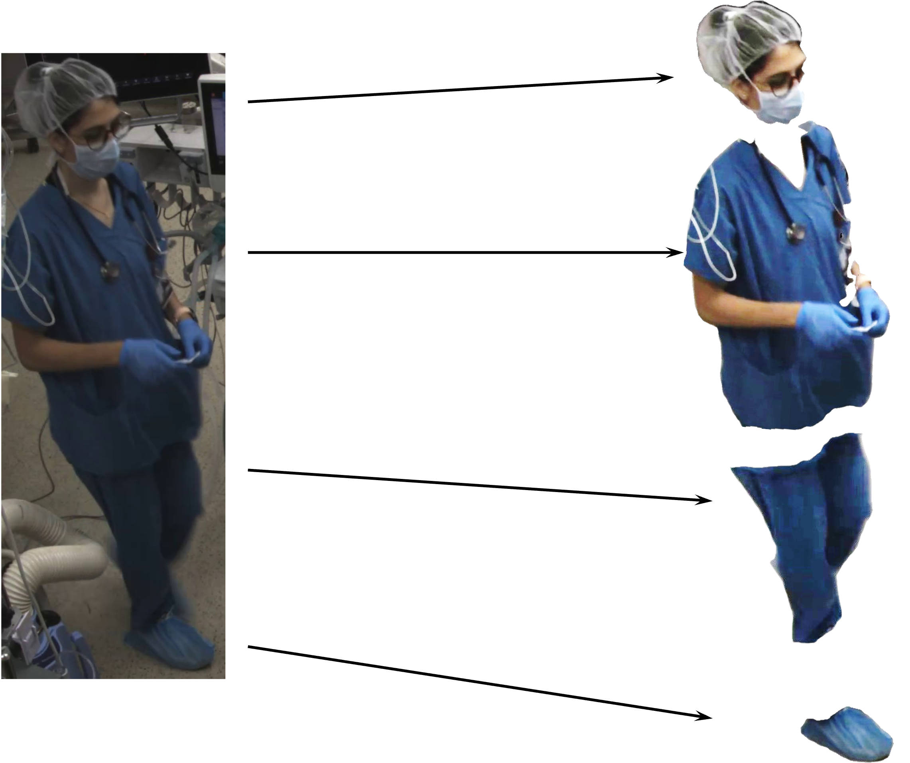

# SurgiTrack: Multi-Camera Multi-Person Tracking in Operating Rooms


https://github.com/user-attachments/assets/b5da39fa-3c4b-4364-8ac5-ad05cc99c5ba





## Overview
SurgiTrack is a multi-camera multi-person tracking system designed for operating rooms. It leverages advanced computer vision techniques and innovative algorithms to accurately track multiple people simultaneously. The system aims to enhance behavioral research of medical staff during surgeries, providing insights into interactions and workflows to improve surgical outcomes.

## Project Structure
```
.
├── BoT-SORT
├── dinov2_environment.yml
├── bot_sort_environment.yml
├── dino-vit-features
├── main_pipeline.sh
├── main_pipeline_with_clustering.sh
├── Self-Correction-Human-Parsing
├── video_output.ipynb
└── videos
```

### Main Directories and Files
- **BoT-SORT**: Contains the BoT-SORT tracking algorithm and related files.
- **dinov2_environment.yml**: Environment configuration file for DinoV2.
- **dino-vit-features**: Contains files and scripts related to DinoV2 feature extraction.
- **bot_sort_environment.yml**: Environment configuration file for bot_sort.
- **main_pipeline.sh**: Script to run the main tracking pipeline.
- **main_pipeline_with_clustering.sh**: Script to run the tracking pipeline with clustering.
- **Self-Correction-Human-Parsing**: Directory containing the human parsing model and related files.
- **video_output.ipynb**: Jupyter notebook for video output visualization.
- **videos**: Directory containing video files used in the project.

## Installation

### Prerequisites
- Python 3.7 or higher
- CUDA-enabled GPU
- Conda

### Setting Up the Environment

1. **Clone the repository:**
   ```bash
   git clone https://github.com/litvingil/surgitrack.git
   cd surgitrack
   ```

2. **Install dependencies:**
   ```bash
   conda env create -f dinov2_environment.yml
   conda env create -f bot_sort_environment.yml
   ```

## Usage

### Running the Pipeline

1. **Run the main pipeline:**
   ```bash
   bash main_pipeline.sh
   ```

2. **Run the pipeline with clustering:**
   ```bash
   bash main_pipeline_with_clustering.sh
   ```

### Visualization
To visualize the results, you can use the Jupyter notebook provided in the project:

**notebook video_output.ipynb** - update the inputs and run

## Project Description
SurgiTrack is a multi-camera multi-person tracking system tailored for operating rooms. It combines computer vision and tracking algorithms to analyze medical staff interactions during surgeries. By utilizing advanced techniques like BoT-SORT and Vision Transformers, the system can accurately identify and re-identify individuals, overcoming challenges such as similar uniforms and partial occlusions.

### Results
The system achieved an accuracy of 80% for inter-camera assignment when intra-camera clustering was performed manually. Without clustering, the accuracy dropped to 56.25%. The results demonstrate the effectiveness of the modular pipeline in providing reliable tracking in a complex environment.

### Conclusion
SurgiTrack represents a significant advancement in enabling behavioral research in operating rooms. By addressing the unique challenges of the operating room environment, the system provides a robust foundation for analyzing medical staff interactions and workflows.

## Contributors

- Sapir Gershov (Advisor)
- Omer Paz 
- Gil Litvin 

## References
The project relies on several key references for algorithms and models:
- [BoT-SORT: Robust Associations Multi-Pedestrian Tracking](https://arxiv.org/abs/2206.14651)
- [DINOv2: Learning Robust Visual Features without Supervision](https://arxiv.org/abs/2304.07193)
- [Self-Correction for Human Parsing](https://arxiv.org/abs/1910.09777)
- [Torchreid: A Library for Deep Learning Person Re-Identification in Pytorch](https://arxiv.org/abs/1910.10093)
- [Real-Time Flying Object Detection with YOLOv8](https://arxiv.org/abs/2305.09972)
